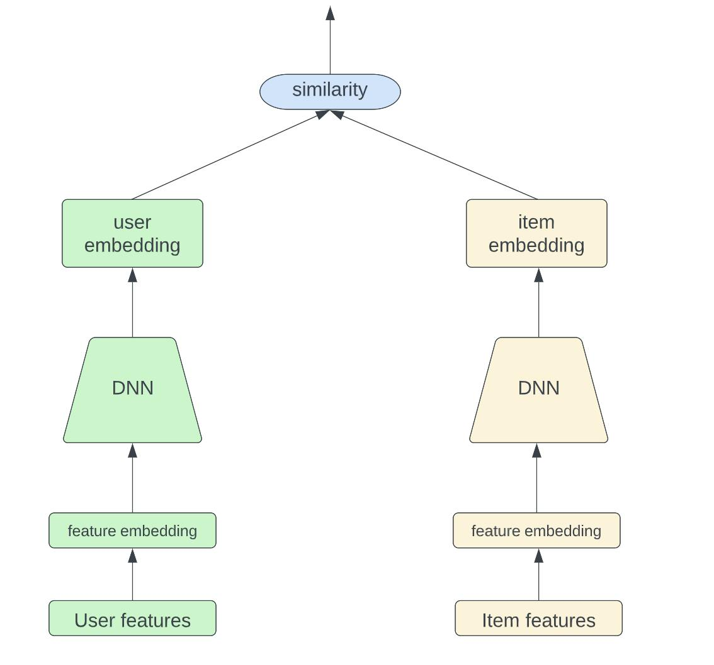

# Deep-Learning Recommender System using TensorFlow

Developing a real-world recommender system using deep learning in TensorFlow.

## Project Outline:
1. Data processing.
2. Implementing a Two-Tower model with TensorFlow.
3. Simulate real world inference.
4. Implement retrieval and ranking.
5. Handling feedback loop.

## Data Processing

### Test-train split

There are two common approaches in choosing the test data:
1. Random splitting.
2. Last samples chronologically.

We choose method 2. Here, the model learns from old data and is tested on new data. This creates a more realistic scenario for the model to be tested on. However, the drawback is that since we are hiding the newest data from our model, the model does not learn the most relevant samples we have. Given time, we would like to test both approaches.

### Preprocessing Genres
Genres were processing using multi-hot vector encoding,  creating one column in the dataset for each dimension of the vector.

### Processing Titles

## TensorFlow Recommenders

### Setting a baseline
First we calculate the baselines that we'll use to compare our predictions to. We will use root mean squared error (RMSE) metic to measure model performance.

The lowest RMSE we reached without traininga model was 1.25.

### Two-tower approach.

The two-tower model consists of two separate neural networks (towers), one for encoding user features and the other for encoding item features. The key idea is to learn compact representations (embeddings) for both users and items in such a way that similar users and items have similar embeddings.

